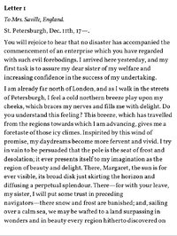

# Aristotle

Aristotle is a minimalist and opinionated epub reader written in pure rust which will eventually be
usable on a wide variety of cross-platform devices such as Kobo and Boox ebook readers. It owes almost all of its inspiration to the fantastic Plato.

It will focus on accurate and correct text rendering, but it will probably never support CSS in the ebooks.

## Screenshots

